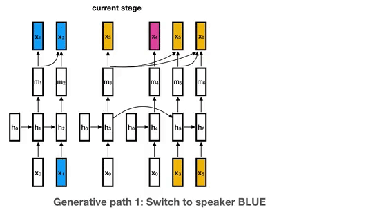

# UIS-RNN

## Overview

This is the library for the
*Unbounded Interleaved-State Recurrent Neural Network (UIS-RNN)* algorithm.
UIS-RNN solves the problem of segmenting and clustering sequential data
by learning from examples.

This algorithm was originally proposed in the paper
[Fully Supervised Speaker Diarization](https://arxiv.org/abs/1810.04719).



## Disclaimer

This open source implementation is slightly different than the internal one
which we used to produce the results in the
[paper](https://arxiv.org/abs/1810.04719), due to dependencies on
some internal libraries.

We CANNOT share the data, code, or model for the speaker recognition system
(d-vector embeddings) used in the paper, since the speaker recognition system
heavily depends on Google's internal infrastructure and proprietary data.

**This library is NOT an official Google product.**

## Dependencies

This library depends on:

* python 3.5+
* numpy 1.15.1
* pytorch 0.4.0

## Tutorial

### Run the demo

To get started, simply run this command:

```bash
python3 demo.py --train_iteration=20000
```

This will train a UIS-RNN model using `data/training_data.npz`,
then store the model on disk, perform inference on `data/testing_data.npz`,
print the inference results, and save the approximate accuracy in a text file.

PS. The files under `data/` are manually generated *toy data*,
for demonstration purpose only.
These data are very simple, so we are supposed to get 100% accuracy on the
testing data.

### Core APIs

All algorithms are implemented as the `UISRNN` class. First, construct a
`UISRNN` object by:

```python
model = UISRNN(args)
```

Next, train the model by calling the `fit()` function:

```python
model.fit(train_sequence, train_cluster_id, args)
```

Once we are done with the training, we can run the trained model to perform
inference on new sequences by calling the `predict()` function:

```python
predicted_label = model.predict(test_sequence, args)
```

The definitions of the args are described in `model/arguments.py`.

### Run the tests

You can also verify the correctness of this library by running:

```bash
sh run_tests.sh
```

If you fork this library and make local changes, be sure to use these tests
as a sanity check. Besides, these tests are also great examples for learning
the APIs.

## Citations

Our paper is cited as:

```
@article{zhang2018fully,
  title={Fully Supervised Speaker Diarization},
  author={Zhang, Aonan and Wang, Quan and Zhu, Zhenyao and Paisley, John and Wang, Chong},
  journal={arXiv preprint arXiv:1810.04719},
  year={2018}
}
```
